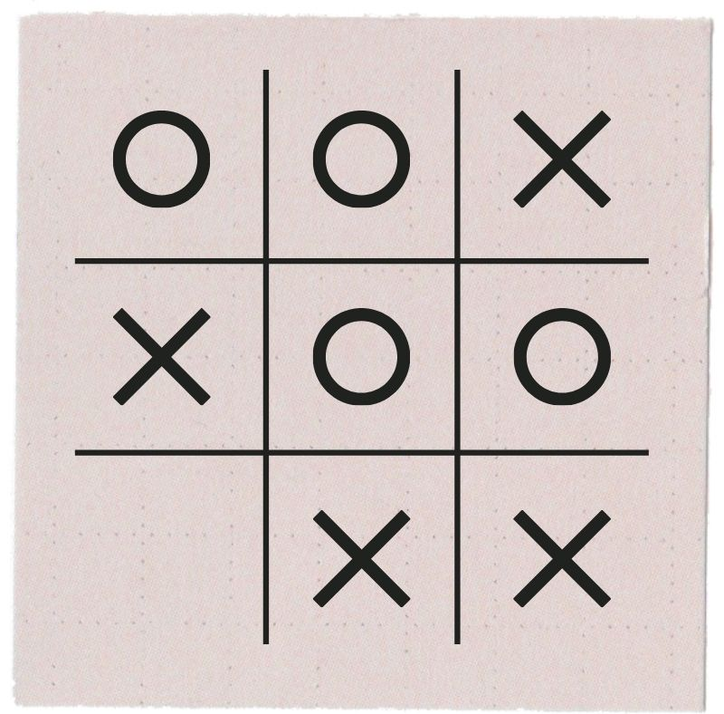
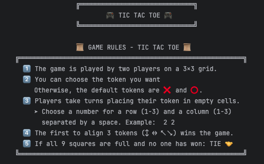
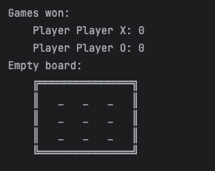
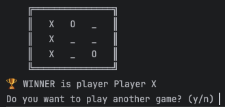

# Let's play Tic Tac Toe!

- [Let's play Tic Tac Toe!](#-lets-play-tic-tac-toe-!)
  - [⭕❌ About the project](#-about-the-project-)
  - [🎛️ Features](#-features)
    - [How to play](#how-to-play)
  - [ 🖼️ Views](#-views)
  - [📋 Technical requirements](#-technical-requirements)
    - [Functional](#functional)
    - [Non-functional](#non-functional)
  - [🛠️ Working environment](#-working-environment)
    - [Tools](#tools)
    - [Programming language](#programming-language)
    - [Methodologies](#methodologies)
  - [🧪 Testing](#-testing)
  - [💻  Installation](#-installation)
  - [🚀 Next steps](#-next-steps)
  - [👥 Authors](#-authors)

## ⭕❌ About the project 

We developed the classic game known as **Tic Tac Toe**, or Tres en Raya, where two players participate, represented by tokens **X** and **O**. The dynamics of the game are played out on a grid of **3x3** and player X always makes the first move.

The objective of each player is to line up three of their tokens in a row, be it in vertical, horizontal or diagonal. In the event that all squares of the board are filled and neither player gets a winning line the game ends in a tie. 

When each game comes to an end the final result is shown, informing if one of the players has won or if it’s a tie.

**Context**\
This project was developed as part of the FemCoders P1 Bootcamp (Project for educational use).

## 🎛️ Features

**Additional features**
- Choose your personalized name and token used in the board.
- Save the number of games won

### How to play

The rules of the game are printed on screen.

1️⃣  You have the option to choose personalized tokens for the game. Choose y or n. If you decide not to personalize the default players/tokens are X and O.

The board is printed on screen.

2️⃣  Now, as instructed on screen, the first player chooses where they want to place their token.\
After each turn the board is printed showing the last move.

3️⃣ The game continues with each player choosing their move alternately.

4️⃣ The first to align 3 tokens wins the game.\
If all 9 squares are full and no one has won it's a tie.    

5️⃣ Now the player can decide to continue playing. y/n  

If no the program prints on screen the number of games played and how many each player has won and the program finishes.

##  🖼️ Views

  

## 📋 Technical requirements

### Functional

- Plan sprint on a product backlog. 
- Use GitFlow. 
- Show empty board at the start of the game. 
- Show updated board after every move. 
- Play in turns, first user X and then user O.
- Choose move by entering number of row and column. 
- Check if the square is free when user enters their movement and show an error if this square is already used. 
- Check after every move if there’s a winner. 
- If all squares are full check if there’s a winner or if it’s a tie. 
- Show a message to indicate winner or if it’s a tie. 
- Partially tested (unit testing).

### Non-functional

- Screen view generated by Terminal. 
- Follow the conventions of Java good practice.
- Use appropriate naming for classes, attributes and methods.

## 🛠️ Working environment

### Tools

### Programming language
Java 21 

### Methodologies
- GitFlow
- Agile

## 🧪 Testing

Unit testing with JUnit 5 framework for:
- Board class
- Game class

##  💻  Installation

> You need to have Java 21 installed in order to execute the program. 

1. Open the file in your preferred IDE
2. Execute the program on the Main file. This Main file contains the Main class.
3. There are 3 other files that contain the classes Player, Game and Board.

## 🚀 Next steps

- Terminate game if it's a draw even if there are free squares. 
- Check if there's a winner only if requirements have been met (have played 3 rounds).
- Keep count and show games that are a tie.
- Add a Dockerfile to build the image of our java application. 
- Add a Jenkinsfile to define the Build and Deploy Stages. 

## 👥 Authors
- [Débora Rubio](https://github.com/debsrdev
)
- [Mayleth Carrascal](https://github.com/may-leth)
- [Mary Kenny](https://github.com/marykenny123)
- [Iris Sánchez](https://github.com/isanort)